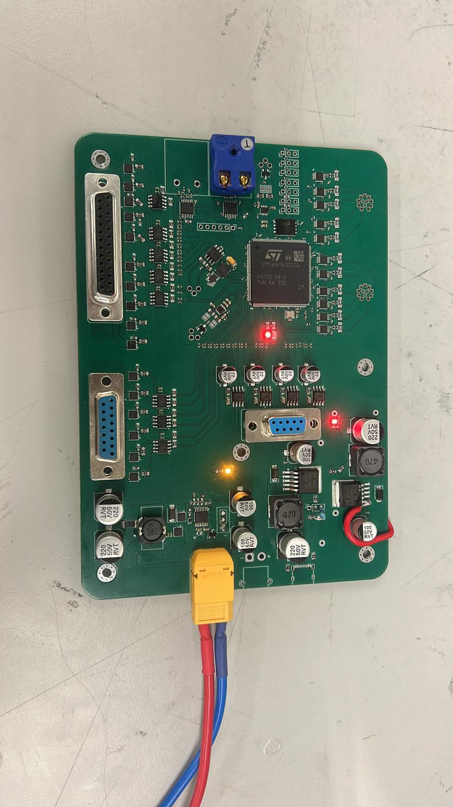

# Engine Control Unit — Karman Space Programme

STM32-based ECU for a liquid bipropellant rocket engine.

## Overview

This project involved the design and firmware development of an Engine Control Unit
for a liquid bipropellant rocket engine.

## Key Features

- STM32 microcontroller
- 1 Mbps CAN bus
- 24V / 2A solenoid valve drivers
- High-speed SPI sensors (10 MHz)

## Skills

- Schematic Design
- PCB Layout Design
- Mixed Signal Design
- High Speed Design
