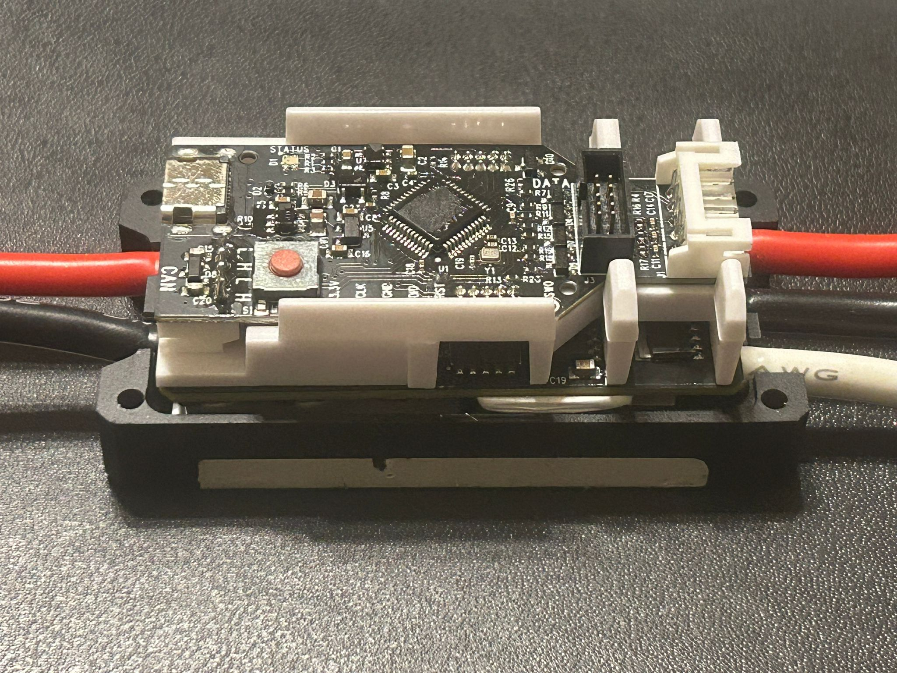
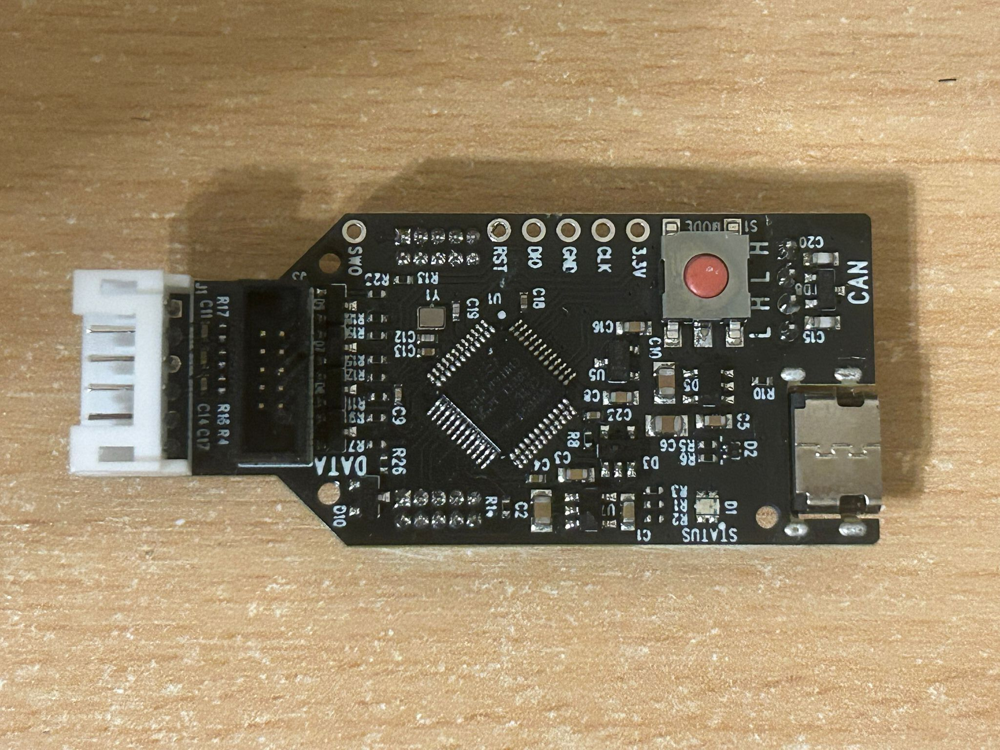
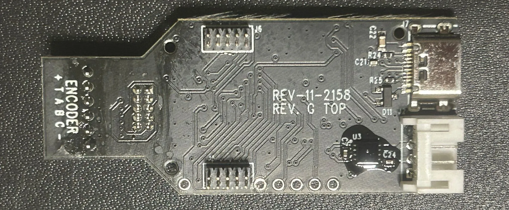
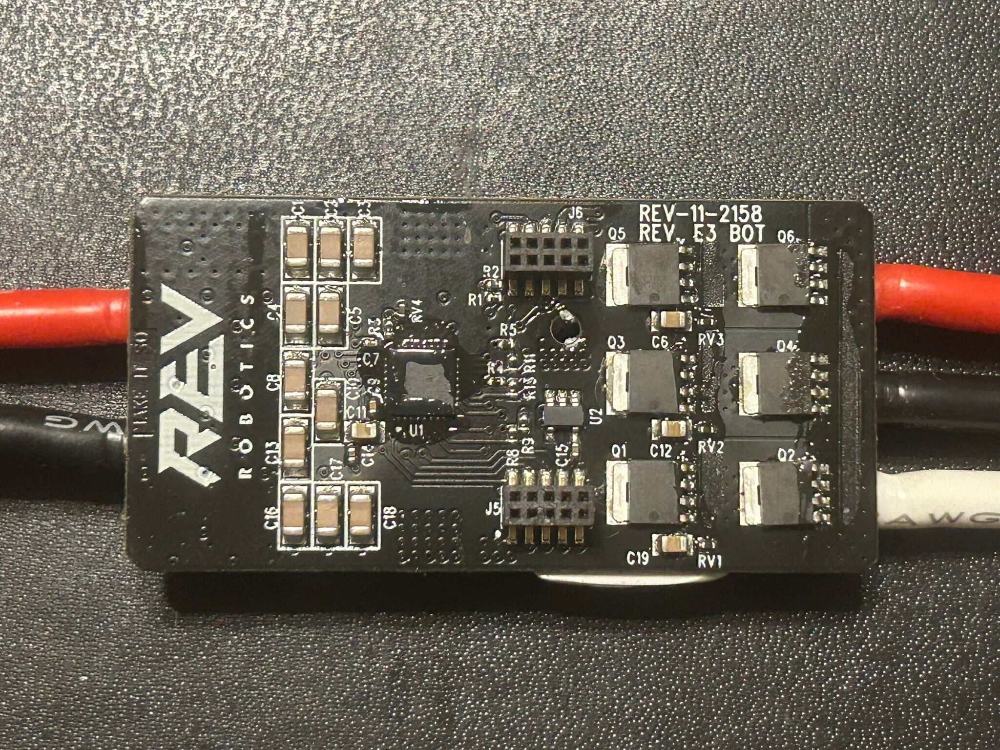

# SPARK MAX Motor Controller - A Guide
 
A guide to using the REV Robotics motor controller outside the FRC ecosystem, as well as a thorough breakdown and reverse-engineering of the internals. This motor controller is frequently paired with the NEO 550 motor.



## Overview

It is possible for the Spark MAX to be controlled over PWM alone - but using CAN BUS unlocks an array of new features, such as:
- PID-based control over motor position and velocity
- "on-the-fly" PID tuning
- being able to receive analog sensor output + transmit over CAN BUS

The Spark MAX was intended to be used on KSP's first liquid bipropellant rocket, Vega, in conjunction with the NEO 550 motor. However, due to multiple niche issues, which were undebuggable due to the closed-source nature of the firmware, we chose to bin the Spark MAX in favour of an open-source FOC-based VESC-compatible controller that supports local scripting in LispBM.

## Contents

- Disassembly and Circuit schematic
- How to control over CAN BUS via an Arduino/STM32/etc instead of FRC hardware
- Reverse-engineering the Version 25 Firmware IDs

## Dissasembly

1st PCB



2nd PCB



### Parts Used

Microcontroller (1st PCB, U1) - STM32F302CC

Motor Driver (2nd PCB, U1) - DRV8320S

MOSFET (Q1-6) - hard to say. The markings are "10030L Prm 2420 67 1911". Other sources suggest the PSMN1R0-30YLD, which when Googled has similar but not exactly identical markings. Overall the MOSFET is likely to be rated for 30V. 

CAN Transceiver (1st PCB, U3) - hard to say. Other sources suggest that it is a "6563MKD" which I assume refers to the ATA6563.

### Further References
A similar breakdown can be found here: https://www.chiefdelphi.com/t/rev-spark-max-teardown/461514/3

## Circuit Schematic
In progress

## CAN BUS control via an Arduino/STM32/non-FRC hardware

### How is it possible? 
- The basics of CAN BUS communication are more or less the same for any CAN-enabled device
- Any CAN BUS command will contain a Frame ID and a data payload 
- The Frame ID corresponds to the type of command - e.g. duty cycle control, position control, heartbeat, etc.
- The data bytes corresponds to "how much" of the command you want. Naturally a bigger number = higher value
- In order for CAN communication to function, a periodic Heartbeat command must be send at least once every 100ms
- To execute a certain command, use the corresponding Frame ID + use the data bits to set quantity/"how much"
- IMPORTANT: the Frame ID must be bitwise OR'd with the Device ID that the Spark MAX was assigned in Firmware via the REV Hardware Client before sending (refer to the Arduino sketch for a better understanding)
 - In a network of MAXes, the Device ID allows you to command a specific motor controller

### CAN Frames

```c++ 
// Snippet from amadorjosephg's Arduino sketch
// Lists all Frame IDs

enum control_mode { 
  Duty_Cycle_Set = 0x2050081,
  Speed_Set = 0x2050480,
  Smart_Velocity_Set = 0x20504C0,
  Position_Set = 0x2050C80,
  Voltage_Set = 0x2051080,
  Current_Set = 0x20510C0,
  Smart_Motion_Set = 0x2051480
};

// Heartbeat Frame
const uint32_t HEARTBEAT_ID = 0x2052C80;

```

### Control Types
These mainly correspond to those that can be found in Rev Hardware Client:
- Heartbeat - required at least every 100ms (10Hz), althoug a higher frequency probably wouldn't hurt
- Duty Cycle - the equivalent of using PWM to control the motor instead of CAN 
- Position, Velocity, etc - these are control modes only available over CAN BUS

### Telemetry and Status Frames
Via firmware, the Spark MAX can be programmed to send out periodic "status frames" that correspond to specific information from the motor controller, such as current consumption, analog sensor readings, motor temperature and more. For more information refer to https://docs.revrobotics.com/brushless/spark-max/control-interfaces.

### Status Frames

```
enum status_frame_id {
  status_0 = 0x2051800,
  status_1 = 0x2051840,
  status_2 = 0x2051880,
  status_3 = 0x20518C0,
  status_4 = 0x2051900
};
```

### Setup
>[!WARNING] IMPORTANT: Use the REV Hardware Client to downgrade the Spark Max to Firmware Version 24. It will not work on Version 25 and above.

### For Arduino 

#### Hardware
- MCP2515
- Any microcontroller that supports SPI

#### Software
- Refer to https://drive.google.com/drive/folders/1NHbtK66bta3y3E9ZzLP2e2HECjd-sEGd for Arduino sketches.
- Note: These were not written by me, but by an "amadorjosephg", judging from his email.
- WARNING: There have been "glitching" issues with the MCP2515 method in the past, regardless of the CAN library used. When using duty cycle control, the motor speed dips suddenly and then goes back to normal. This may be improved by lowering the frequency of Heartbeat commands sent.

### For STM32

- You have two options - use an SPI port or a CAN port
- Whether or not your STM32 board natively supports CAN BUS depends on the model number
- CAN is typically supported on F-series, G-series and H-series MCUs (e.g. F303, G474, H743). It won't be supported by L-series
- Although your STM32 may have an inbuilt CAN controller, it will not have a CAN transceiver. You will need to buy an external one such as the TJA1051.

#### Option 1: SPI Control
- SPI is the same procedure as for Arduino
- One would also have to set up the STM32duino core to program via Arduino IDE

#### Option 2: Inbuilt CAN Controller + CAN Transceiver
- Obtain an external CAN tranceiver, e.g. TJA1051
- Connect to the RX and TX pins of your chosen CAN port on the STM32
 - Note that RX->RX and TX->TX. This is not like UART where it connects the other way round.
- Code TBC

### Other open-source communication projects from the community
- Linux-based CAN bus interface - https://github.com/grayson-arendt/sparkcan
- (deprecated) SPARK MAX Server CLI Tool - https://github.com/REVrobotics/SPARK-MAX-Server

### Running into Problems?
- Note that for communication with multiple MAXes on one BUS, you will need a 120 termination resistor on both ends of the bus  the MAXes do not have their own. However, you should be able to get away with direct communication to a single MAX.
- Ensure that all MAXes are tied to a common ground.
- Ensure all MAXes have a unique Device ID and that you are writing to that specific ID
- CAN Bitrate MUST be 1MBPS
- Avoid powering at 24V or above - the firmware starts bugging out despite 24V technically being within spec. 

## Reverse-engineering Version 25

### Setup
- Install usbrply - https://github.com/JohnDMcMaster/usbrply
- Install WireShark
- Connect the MAX to a PC running REV Hardware Client

### Steps to capture and replay USB packets
- Follow the procedure outlined in the usbrply github repo, under 'Sample workflows > Capturing Windows traffic and replaying traffic in Python'
- Just after you start recording in Wireshark, run the desired action to decode from Rev Hardware Client
- The idea is that Wireshark saves the USB frames to a .pcapng file.
- The .pcapng can be used to generate a `replay.py` Python script via usbrply.
- `replay.py`, as the name suggests, can replay what was recorded over USB

### Decoding a USB packet
- The USB frames can be found within the `replay.py` file itself
- They will be of the form:

```
# Heartbeat Command
bulkWrite(0x02, b"\x00\x00\x00\x00\x80\x2C\x05\x82\x08\x00\x00\x00\x02\x00\x00\x00"
            b"\x00\x00\x00\x00\x00\x00\x00\x00")
```
Note that the hex digits are in little endian. This can be translated to:
- 0x00000000
- 0x82052C80
- 0x00000008
- 0x00000002
- 0x00000000
- 0x00000000

Another example:

```
# Set Duty Cycle to 1%

bulkWrite(0x02, b"\x00\x00\x00\x00\x81\x00\x05\x82\x08\x00\x00\x00\xB8\x1E\x05\x3E"
            b"\x00\x00\x00\x00\x00\x00\x00\x00")
```

Translation
- 0x00000000
- 0x82050081 (Duty Cycle Frame ID)
- 0x3E-05-1E-B8-00-00-00-08 (Duty cycle Data Payload) 
- 0x00000000
- 0x00000000

Only the first four bytes of the payload had a noticeable effect. Changing the first byte (3E) will have a much larger impact than changing the fourth byte (B8).


### My modified Python script to run CAN-over-USB commands


### Known Frame IDs
- Position Control - 0x2050101
- Heartbeat - 0x2052C80 (same as Ver. 24)
- Duty Cycle - 0x2050081 (same as Ver. 24)
- Unknown - 0x2050001
